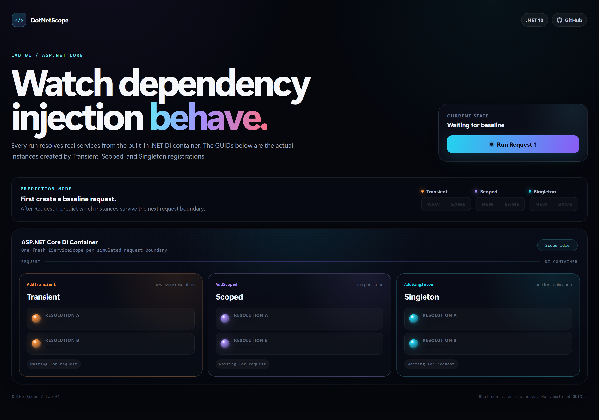
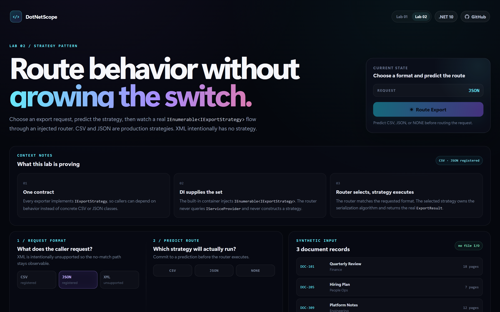

# DotNetScope - .NET Visual Lab

Interactive .NET experiments that make runtime behavior and design patterns visible.

DotNetScope is a learning-first portfolio project. Each lab focuses on one concept, asks the learner to predict what will happen, executes real .NET code, and then visualizes the actual result. The goal is to replace memorized definitions with observable behavior.

## Visual preview

### Lab 01 - Dependency Injection Lifetimes

[](docs/images/lab01-overview.png)

### Lab 02 - Strategy Pattern: Document Export Router

[](docs/images/lab02-overview.png)

The Lab 02 page is intentionally longer because it includes the live routing pipeline, prediction feedback, before/after design comparison, and the Open/Closed proof. A full-resolution capture can be kept separately and linked rather than squeezed into the README:

[Open the full Lab 02 page capture](docs/images/lab02-full.png)

## Lab 01 - Dependency Injection Lifetimes

Lab 01 turns ASP.NET Core dependency injection lifetimes into a visual experiment.

Each run creates a fresh `IServiceScope`, resolves Transient, Scoped, and Singleton services twice, and displays the real GUID-backed instances produced by the built-in .NET dependency injection container.

The UI compares:

- two resolutions inside the same scope
- the same lifetime across consecutive scopes
- your prediction versus the actual runtime result
- the behavior at the request/scope boundary

### Expected behavior

| Lifetime | Within one scope | Across scopes |
| --- | --- | --- |
| Transient | New instance per resolution | New |
| Scoped | Same instance | New |
| Singleton | Same instance | Same |

The visualizer uses real services and real container resolutions. The displayed instance IDs are not simulated animation data.

## Lab 02 - Strategy Pattern: Document Export Router

Lab 02 visualizes how the Strategy pattern can replace growing format-specific branching with interchangeable implementations.

The application registers two production strategies:

- `CsvExportStrategy`
- `JsonExportStrategy`

Both implement:

```csharp
IExportStrategy
```

The built-in .NET DI container supplies the available implementations to:

```csharp
ExportRouter(IEnumerable<IExportStrategy> strategies)
```

The router indexes the injected strategies by their declared format and delegates the export to the matching implementation. It does not construct concrete strategies and does not query `IServiceProvider`.

The interactive lab lets you:

- choose CSV, JSON, or intentionally unsupported XML
- predict which strategy will execute before routing
- watch the request move through the real routing pipeline
- inspect the actual generated CSV or JSON payload
- observe the real unsupported-format failure path
- compare a growing `switch` with the Strategy-based design
- see prediction feedback after execution

### Open/Closed proof

The test project defines a third `FakeExportStrategy` that production code does not know about.

`ExportRouter` can execute that strategy without being modified. The test demonstrates that the router depends on the `IExportStrategy` abstraction and collection rather than hardcoded concrete classes.

### Lab 02 behavior covered by tests

- CSV strategy selection and output
- JSON strategy selection and output
- case-insensitive routing
- whitespace-trimmed format input
- blank-format rejection
- null-document rejection
- valid output for an empty document collection
- CSV escaping for commas, quotes, and line breaks
- explicit unsupported-format failure
- duplicate format registration failing fast
- test-only third-strategy extensibility

## Why this exists

Reading framework APIs and design-pattern definitions is easier than building a durable mental model of what the runtime is actually doing.

DotNetScope follows a simple loop:

1. understand the concept
2. predict the behavior
3. execute real code
4. inspect the result
5. test the implementation
6. explain why the result occurred

Each lab stays deliberately narrow so the visualization teaches one concept instead of hiding it behind unrelated infrastructure.

## Tech

- .NET 10
- ASP.NET Core
- Blazor Interactive Server
- C#
- built-in .NET dependency injection
- `System.Text.Json`
- xUnit
- GitHub Actions CI

## Local run

```powershell
dotnet restore DotNetVisualLab.slnx
dotnet test DotNetVisualLab.slnx --configuration Release
dotnet run --project src\DotNetVisualLab.Web
```

Then open:

- `/` for Lab 01
- `/strategy` for Lab 02

## Validation

The project currently has 13 passing automated tests across Lab 01 and Lab 02.

The delivery gate for each lab is:

```powershell
dotnet build DotNetVisualLab.slnx --configuration Release
dotnet test DotNetVisualLab.slnx --configuration Release
git diff --check
```

The UI is also manually exercised through its supported prediction and runtime paths before the feature is merged.

## Engineering workflow

Each lab follows the same delivery discipline:

1. learn and explain the concept
2. define the smallest useful experiment
3. implement real behavior
4. add automated tests and edge cases
5. inspect the interactive UI
6. run the full Release validation gate
7. open a feature pull request
8. require green GitHub Actions CI
9. squash merge
10. sync `main` and remove the feature branch

## CI

Every push to `main` and every pull request targeting `main` runs:

1. restore
2. Release build
3. tests

This provides an independent validation gate outside the developer machine.

## Roadmap

- Lab 01: Dependency Injection lifetimes
- Lab 02: Strategy Pattern / document export routing
- Lab 03: Middleware pipeline ordering
- Lab 04: Async/await execution flow
- Lab 05: EF Core tracking vs no-tracking
- Lab 06: Caching behavior

New labs are added only after the underlying concept is learned and tested.
